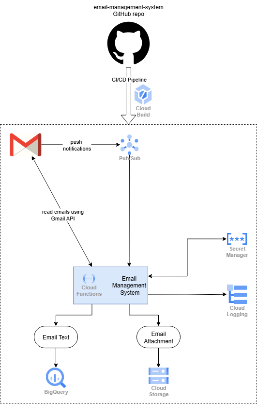

# Email Management and Processing System

Email Management System (EMS) is a Python-based serverless application built using Google Cloud Functions, having comprehensive email management, processing, and storage capabilities. It processes emails by automatically extracting Gmail messages and storing structured data in BigQuery. Moreover, the email attachments (if any) are saved in Cloud Storage.


---

## 🧱 Tech Stack Summary

| **Category** | **Technology** | **Purpose** |
|--------------|----------------|-------------|
| **Language** | Python 3.13 | Primary programming language |
| **Compute** | Google Cloud Functions Gen 2 | Serverless email processing |
| **Database** | Google BigQuery | Raw email storage |
| **Storage** | Google Cloud Storage | Email attachments storage |
| **Messaging** | Google Cloud Pub/Sub | Event-driven notifications |
| **Security** | Google Secret Manager | OAuth token storage |
| **Authentication** | OAuth 2.0 + Gmail API | Gmail access |
| **CI/CD** | Google Cloud Build | Automated deployment |
| **Version Control** | GitHub | Code repository |
| **Monitoring** | Cloud Logging/Monitoring | Observability |

## Key Python Libraries

| **Library** | **Purpose** |
|-------------|-------------|
| `functions-framework` | Cloud Functions runtime |
| `google-api-python-client` | Gmail API integration |
| `google-auth` | Google authentication |
| `google-cloud-bigquery` | Database operations |
| `google-cloud-storage` | Storage operations |
| `google-cloud-pubsub` | Message handling |
| `google-cloud-secret-manager` | Credential management |

---

## 📋 Table of Contents

- [Quick Start](#-quick-start)
- [Architecture](#️-architecture)
- [Prerequisites](#-prerequisites)
- [Configuration](#️-configuration)
- [GCP Resources Setup](#️-gcp-resources-setup)
- [Development Setup](#️-development-setup)
- [Testing](#-testing)
- [Project Structure](#-project-structure)
- [Cloud Function Deployment](#️-cloud-function-deployment)
- [API Reference](#-api-reference)
- [Monitoring and Logging](#-monitoring-and-logging)
- [Error Handling](#-error-handling)
- [Security Considerations](#-security-considerations)
- [Troubleshooting](#-troubleshooting)
- [Future Enhancements](#-future-enhancements)
- [License](#-license)
- [Acknowledgment](#-acknowledgments)

---

## ⚡ Quick Start
For experienced developers who want to get running fast:
1. `git clone [repo]`
2. Follow [PROJECT_SETUP.md](PROJECT_SETUP.md) for GCP resources
3. `pip install -r requirements.txt`
4. Deploy with the commands in [Cloud Function Deployment](#cloud-function-deployment)

---

## 🏗️ Architecture

The application follows a modular architecture:

- **Authentication Layer**: Handles OAuth2 for Gmail, BigQuery, and GCS
- **Processing Layer**: Extracts email content and attachments
- **Storage Layer**: Manages data persistence in Google Cloud services
- **Orchestration Layer**: Coordinates the entire workflow



Key features of the architecture are:

- **Event-Driven Serverless**: Gmail → Pub/Sub → Cloud Functions → Data Storage
- **Gmail API Integration**: Secure OAuth2 authentication with Gmail
- **Email Processing**: Extract email content, headers, and metadata  
- **Attachment Management**: Download and upload attachments to Google Cloud Storage
- **BigQuery Storage**: Store processed email data in BigQuery for analytics
- **Cloud Function Ready**: Designed to run as serverless Google Cloud Functions
- **Error Handling**: Comprehensive error handling and logging
- **Scalable Architecture**: Efficient design for maintainability and testing

---

## 📋 Prerequisites

Before you begin, ensure you have:

- Python 3.8 or higher
- Google Cloud Project with billing enabled
- Gmail API enabled
- Cloud Functions, BigQuery, and Cloud Storage APIs enabled
- Service account with appropriate permissions

---

## ⚙️ Configuration

### 1. Create Configuration File

Populate `src/config.ini` with desired project resource information. Same information will be used later to create resources using `gcloud` utility. Sample settings for the `DEV` environment are shown below.

```python
[dev]
PROJECT_ID = email-management-system-96bc
EMAIL_ID = aamirjadoon001@gmail.com
CREDENTIALS_FILE = credentials.json
SECRET_NAME = gmail-token
GMAIL_SCOPES = https://www.googleapis.com/auth/gmail.modify
GCS_BUCKET_NAME = gmail-attachments-bucket-96bc-2fba
BIGQUERY_DATASET = idp
BIGQUERY_TABLE = gmail_raw_emails
PUBSUB_TOPIC = email-notifier-topic
SERVICE_ACCOUNT = email-notifier-dev-sa@{$PROJECT_ID}.iam.gserviceaccount.com
```

### 2. BigQuery Schema

For the BigQuery table, we need to define the schema. The following information is saved in the BigQuery table. Any changes to this schema needs changes in the relevant code. We create the schema using `gcloud` command later.

#### Email Metadata Schema

| Field | Type | Description |
|-------|------|-------------|
| `message_id` | STRING (Required) | Unique Gmail message ID |
| `thread_id` | STRING | Gmail conversation thread ID |
| `subject` | STRING | Email subject line |
| `sender` | STRING | Sender email address |
| `recipient` | STRING | Recipient email address |
| `date_received` | STRING | Original email date string |
| `parsed_date` | TIMESTAMP | Parsed timestamp |
| `body_text` | STRING | Email body content |
| `label_ids` | STRING | Gmail label IDs (JSON) |
| `snippet` | STRING | Email snippet preview |
| `message_size` | INTEGER | Email size in bytes |
| `attachment_count` | INTEGER | Number of attachments |
| `attachments_info` | RECORD (Repeated) | Attachment details |
| `processed_at` | TIMESTAMP | Processing timestamp |

#### Attachment Information Schema

| Field | Type | Description |
|-------|------|-------------|
| `file_id` | STRING | Gmail attachment ID |
| `file_name` | STRING | Original filename |
| `file_type` | STRING | MIME type |
| `gcs_url` | STRING | Cloud Storage download URL |

## ▶️ GCP Resources Setup

Once we define the initial parameters above, the next step is to create those resources and then deploy the source code. Following resources are to be created:

- Create project
- BigQuery table
- Cloud Storage bucket
- Cloud Pub/Sub Topic and Subscription
- Secret key on Cloud Secret Manager
- Working and deployment service accounts with relevant permissions

This is quite involved process and we have created a separate page to go over all the required steps. At the end of these steps, we will be able to run our code locally (using Cloud resources).

GCP Resource Setup Guide: [PROJECT_SETUP.md](./PROJECT_SETUP.md)

---

## 🛠️ Development Setup

1. **Clone the repository**
   ```bash
   git clone https://github.com/jadoonengr/email-management-system.git
   cd email-management-system
   ```

2. **Create virtual environment**
   ```bash
   python -m venv env
   source env/Scripts/activate      # On Windows
   <!-- source env/bin/activate      # On Linux -->
   ```

3. **Install dependencies**
   ```bash
   pip install -r requirements.txt
   ```

4. **Create Gmail access token**
(<span style="color: red;">CRITICAL STEP</span>)
   ```bash
   # Unit test to run script that loads token from Gmail API
   pytest tests/ -k "test_process_emails_real_api_calls" -v
   ```

---

## 🧪 Testing

This project maintains **95%+ test coverage** with a comprehensive testing strategy covering all critical components:

### Test Architecture
- **Unit Tests**: Isolated testing of individual functions with extensive mocking
- **Integration Points**: Gmail API, BigQuery, and Cloud Storage interactions
- **Error Handling**: Exception scenarios and failure modes
- **Edge Cases**: Empty data, malformed inputs, and boundary conditions

### Coverage Areas

| Component | Test File | Coverage |
|-----------|-----------|----------|
| **Main Function** | `test_main.py` | Cloud Function entry point, full workflow |
| **Authentication** | `test_auth_services.py` | Gmail, BigQuery, GCS authentication |
| **Email Processing** | `test_process_emails.py` | Email parsing, attachment extraction |
| **BigQuery Storage** | `test_store_bigquery.py` | Data insertion and error handling |
| **GCS Storage** | `test_store_gcs.py` | Attachment uploads and path generation |
| **Gmail Notifications** | `test_setup_gmail_notifications.py` | Push notification setup |
| **Utilities** | `test_file_utils.py` | Base64 decoding, filename sanitization |

### Key Testing Features
- **Mock Strategy**: External APIs (Gmail, BigQuery, GCS) fully mocked
- **Fixture-Based**: Reusable test data and service mocks
- **Log Verification**: Testing log messages for monitoring
- **Parameter Validation**: Ensuring correct API calls
- **Class-Based Organization**: Logical test grouping

### Running Tests

```bash
# Install test dependencies
pip install pytest pytest-cov

# Run all tests with verbose output
pytest tests/ -v

# Generate coverage report
pytest tests/ --cov=src --cov-report=html --cov-report=term

# Run specific test module
pytest tests/test_main.py -v

# Run tests matching pattern
pytest tests/ -k "test_auth" -v
```

### Test Results
```
================================ tests coverage ================================
_______________ coverage: platform linux, python 3.11.13-final-0 _______________
Name                                          Stmts   Miss  Cover   Missing
---------------------------------------------------------------------------
__init__.py                                       0      0   100%
main.py                                          62      0   100%
src/__init__.py                                   0      0   100%
src/components/auth_services.py                  58      0   100%
src/components/process_emails.py                 65      9    86%   32-37, 58, 87-108
src/components/secret_manager.py                 26      0   100%
src/components/setup_gmail_notifications.py      40      2    95%   92, 96
src/components/store_bigquery.py                 20      0   100%
src/components/store_gcs.py                      22      0   100%
src/config.py                                     5      0   100%
src/utils/file_utils.py                          35      5    86%   52-56
tests/__init__.py                                 0      0   100%
tests/test_auth_services.py                      95      0   100%
tests/test_file_utils.py                         74      0   100%
tests/test_main.py                              217      0   100%
tests/test_process_emails.py                    120      1    99%   88
tests/test_secret_manager.py                     80      0   100%
tests/test_setup_gmail_notifications.py          42      0   100%
tests/test_store_bigquery.py                     52      0   100%
tests/test_store_gcs.py                          47      0   100%
---------------------------------------------------------------------------
TOTAL                                          1060     17    98%
============================== 61 passed in 1.85s ==============================
```

---

## 📁 Project Structure

```
email-processor/
├── src/
│   ├── components/
│   │   ├── auth_services.py              # Authentication services
│   │   ├── process_emails.py             # Email processing logic
│   │   ├── secret_manager.py             # GCP Secret Manager
│   │   ├── setup_gmail_notifications.py  # Manage Gmail Notifications
│   │   ├── store_bigquery.py             # BigQuery operations
│   │   └── store_gcs.py                  # Cloud Storage operations
│   ├── utils/
│   │   └── file_utils.py         # Utility functions
│   ├── config.ini                # Configurations settings
│   └── config.py                 # Configuration management
├── tests/                        # Unit tests
│   ├── 📄 test_main.py                      # Main function tests
│   ├── 📄 test_auth_services.py             # Authentication tests
│   ├── 📄 test_process_emails.py            # Email processing tests
│   ├── 📄 test_secret_manager.py            # Secret manager tests
│   ├── 📄 test_store_bigquery.py            # BigQuery storage tests
│   ├── 📄 test_store_gcs.py                 # GCS storage tests
│   ├── 📄 test_setup_gmail_notifications.py # Notification setup tests
│   └── 📄 test_file_utils.py                # File utilities tests
├── main.py                       # Cloud Function entry point
├── LICENSE.py                    # License agreement
├── PROJECT_SETUP.py              # GCP resource setup instructions
├── README.md                     # This file
└── requirements.txt              # Python dependencies
```

---

## ☁️ Cloud Function Deployment

### Manual Deployment

First we redefine the environment variables, if not done previously.

```bash
export PROJECT_ID='email-management-system-96bc'
export REGION='us-central1'
export ENTRY_POINT='process_emails'
export PUBSUB_TOPIC='email-notifier-topic'
export SERVICE_ACCOUNT_NAME="email-mgmt-dev-sa"
export SERVICE_ACCOUNT_EMAIL="${SERVICE_ACCOUNT_NAME}@${PROJECT_ID}.iam.gserviceaccount.com"
```

Then we run the one-time manual deployment instruction.

```bash
gcloud functions deploy $FUNCTION_NAME \
    --gen2 \
    --runtime=python312 \
    --region=$REGION \
    --source=. \
    --entry-point=$ENTRY_POINT \
    --trigger-topic=$PUBSUB_TOPIC \
    --service-account=$SERVICE_ACCOUNT_EMAIL \
    --memory=512MB \
    --timeout=540s     
```

### Test the Deployment

```bash
gcloud pubsub topics publish $PUBSUB_TOPIC  \
--message '{"emailAddress": "jadoon.engr@gmail.com", "messageId": "abc123"}'
```

```bash
# Test with sample Pub/Sub message
gcloud pubsub topics publish email-notifier-topic \
  --message='{"historyId": "12345"}'
```

You should now have a fully functional email processing system running in your Google Cloud Project!


### CI/CD Pipeline Implementation using Cloud Build

We create the CI/CD pipeline using the Google Cloud Build coupled with the GitHub repository. For this purpose we follow two steps:

Step 1: Connect Google Cloud Platform to the GitHub.

Go to Cloud Build > Triggers

```text
1. Select source code management provider
- Click "Connect Repository"
- Region: global (Global)
- Select "GitHub (Cloud Build GitHub App)"

2. Authenticate
Authenticate and select your repository
- GitHub account: jadoonengr
- Repository: email-management-system

3. Agree to agreement and click connect.
```

Step 2: Create Cloud Build Trigger

Go to Cloud Build > Triggers  
Click "Create Trigger"  
Fill in these details:  

```text
Name: email-mgmt-sys-cb-trigger
Region: global (Global)
Event: Push to a branch

Source: 
- Repository service: Cloud Build Repositories
- Repository generation: 1st gen

- Repository: jadoonengr/email-management-system (GitHub App)
- Branch pattern: ^develop$

Configuration:
- Type: Cloud Build configuration file
- Location: Repository
- Cloud Build configuration file location: deployment/cloudbuild.yaml

Substitution variables:
- Variable 1: _APP_ENV
- Value 1: dev

Service account:  
- Service account name: email-mgmt-deploy-dev-sa@email-management-system-96bc.iam.gserviceaccount.com

Click Create!
```

## 📚 API Reference

### Core Functions

Authentication Services (`src.components.auth_services`)

```code
authenticate_gmail() -> Service | None  
Authenticates Gmail API service using stored credentials.

authenticate_bigquery(project_id: str) -> bigquery.Client | None  
Creates BigQuery client for the specified project.

authenticate_gcs(project_id: str) -> storage.Client | None  
Creates Cloud Storage client for the specified project.
```

### Email Processing (`src.components.process_emails`)

```code
extract_email_body(payload) -> str
Extract text content from email payload.

extract_attachments(gmail_service, message: Dict) -> List[Dict]
Extracts all attachments from a Gmail message.

mark_email_read(gmail_service, message_id: str) -> None
Removes UNREAD label from Gmail message.

read_email(gmail_service, message_id: str) -> Dict
Extracts comprehensive data from a Gmail message.

list_unread_emails(gmail_service, max_results: int = 100) -> List[Dict]
Retrieves list of unread emails from Gmail.
```

### Storage Operations

#### BigQuery Storage (src.components.store_bigquery)

```code
store_emails_in_bigquery(client, table_ref: str, email_data: Dict) -> bool
Inserts email data into BigQuery table.
```

#### Cloud Storage (src.components.store_gcs)

```code
upload_attachment_to_gcs(storage_client, bucket_name: str, file_name: str, file_data: bytes, file_type: str, message_id: str) -> str | None
Uploads email attachment to Google Cloud Storage.
```

### Gmail Notifications (src.components.setup_gmail_notifications)
```code
setup_gmail_push_notifications(gmail_service) -> Dict | None
Configures Gmail push notifications to Pub/Sub topic.

stop_gmail_push_notifications(gmail_service, user_id: str = "me") -> bool
Stops Gmail push notifications.
```

### Utility Functions (src.utils.file_utils)
```code
decode_base64(data_b64: str) -> str
Decodes base64 data with automatic padding correction.

sanitize_filename(filename: str) -> str
Sanitizes filename for filesystem safety.

parse_email_date(date_str: str) -> str
Parse email date string to ISO format.
```

### Secret Manager Functions
```code
upload_secret(project_id: str, secret_name: str, payload: str) -> Any | None
Uploads new version to existing secret.

download_secret(project_id: str, secret_name: str) -> str | None
Downloads latest secret version.
```

### Cloud Function Entry Point
```code
process_emails(cloud_event) -> None
Main Cloud Function handler triggered by Pub/Sub.
```


## 📊 Monitoring and Logging

### Cloud Logging

The application uses structured logging that integrates with Google Cloud Logging:

```python
import logging
logger = logging.getLogger(__name__)

# Log levels used:
logger.info("Processing started")      # General information
logger.warning("No attachments found") # Warnings
logger.error("Failed to upload file")  # Errors
```

### Monitoring Metrics (Future Enhancements)

Track these key metrics in Cloud Monitoring:
- Email processing rate
- Success/failure ratios  
- Attachment upload success
- BigQuery insertion errors
- Function execution time

## 🚨 Error Handling

The application includes comprehensive error handling:

- **Authentication Errors**: Automatic token refresh and re-authentication
- **API Rate Limits**: Built-in retry logic with exponential backoff
- **Network Issues**: Connection timeout and retry mechanisms
- **Storage Errors**: Graceful handling of upload failures
- **Data Validation**: Input validation and sanitization

## 🔒 Security Considerations

- **OAuth2 Tokens**: Securely stored and automatically refreshed
- **IAM Permissions**: Principle of least privilege
- **Data Encryption**: All data encrypted in transit and at rest
- **Sensitive Data**: No email content logged in production
- **Access Controls**: Proper BigQuery and GCS access controls


## 🐛 Troubleshooting

### Common Issues

#### Authentication Errors
```
Error: Gmail authentication failed
Solution: Check credentials file path and OAuth2 setup
```

#### BigQuery Insert Errors
```
Error: BigQuery insertion errors: [...]
Solution: Verify table schema matches data structure
```

#### Storage Upload Failures
```
Error: Failed to upload attachment
Solution: Check bucket permissions and file size limits
```

#### Secret Loading Errors
```
Error: Failed to download secret: 403 Forbidden
Solution: Verify service account has secretmanager.secretAccessor role
```

### Debug Mode

Enable debug logging:
```python
import logging
logging.basicConfig(level=logging.DEBUG)
```

## 📈 Future Enhancements

- [ ] **Batch Processing**: Process emails in configurable batches
- [ ] **Retry Logic**: Exponential backoff for failed operations
- [ ] **Webhook Support**: Direct webhook integration for real-time processing
- [ ] **Email Filtering**: Advanced filtering and labeling capabilities
- [ ] **Analytics Dashboard**: Built-in reporting and analytics
- [ ] **Multi-User Support**: Support for multiple Gmail accounts
- [ ] **Attachment Processing**: OCR and content extraction from attachments


## 📜 License

This project is licensed under the MIT License - see the [LICENSE](LICENSE) file for details.

## 🙏 Acknowledgments

- Google Cloud Platform for robust cloud services
- Gmail API for comprehensive email access
- The Python community for excellent libraries


---

**Made with ❤️ by [Aamir M. Khan](https://www.linkedin.com/in/aamirmehmoodkhan/)**

*If this project helped you, please consider giving it a ⭐!*
